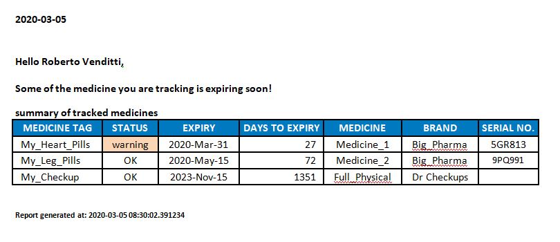
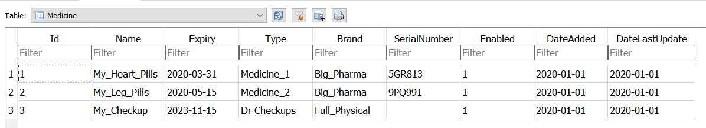
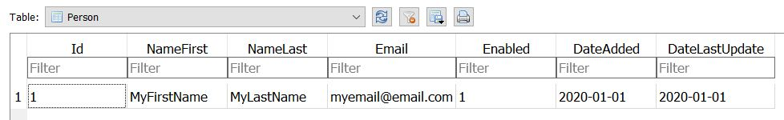
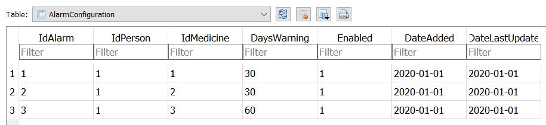

# Medicine Minder

Keep track of items having limited quantity or shelf life, and send a warning email if any are nearing expiry. The original use case is to monitor medications and warn if stock is getting low so that the prescription can be refilled in time.

The script runs a query to see if any medications are expiring soon. If so, it identifies who needs to be notified and generates an html report using . The report is then emailed automatically.

## Medicine (Items to be tracked)
An SQLite database is used to keep track of each medicine, its expiry, and other details:

## Person (People to be notified for each item)
Users are defined in another table:

## Alarm Configuration
A linking table specifies which users needs to be notified for which medicine:

